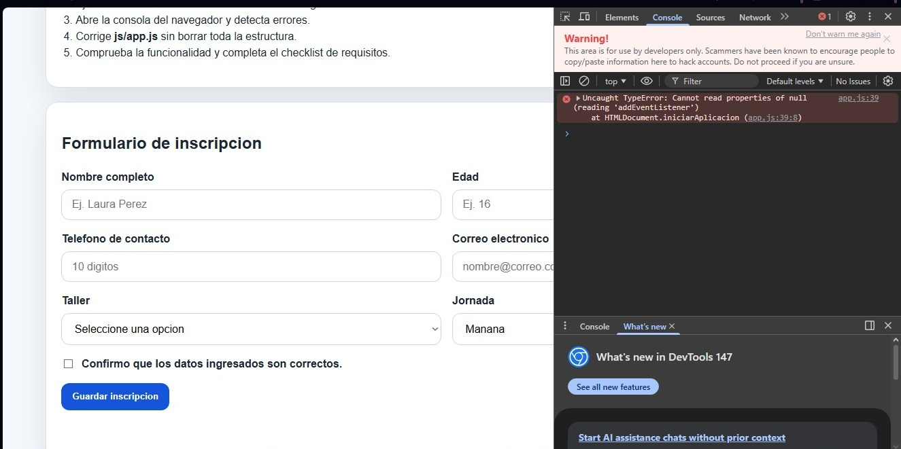
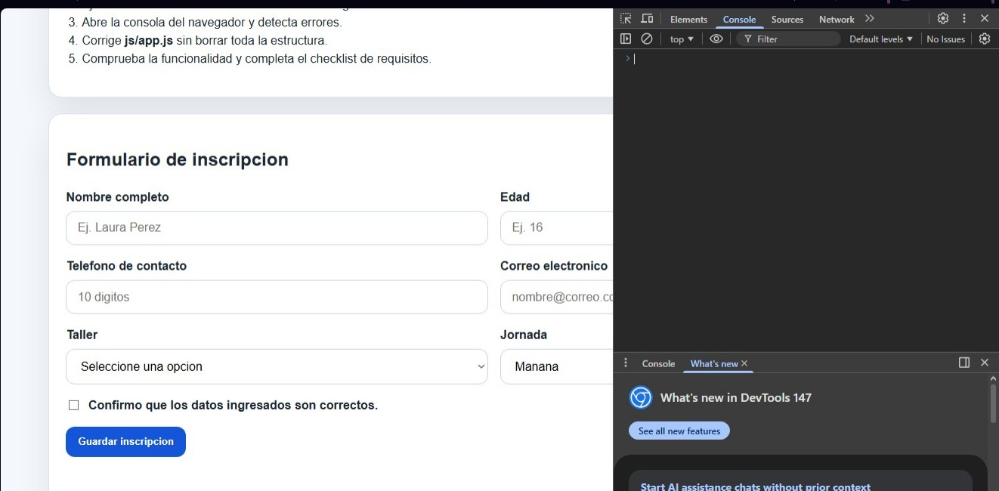
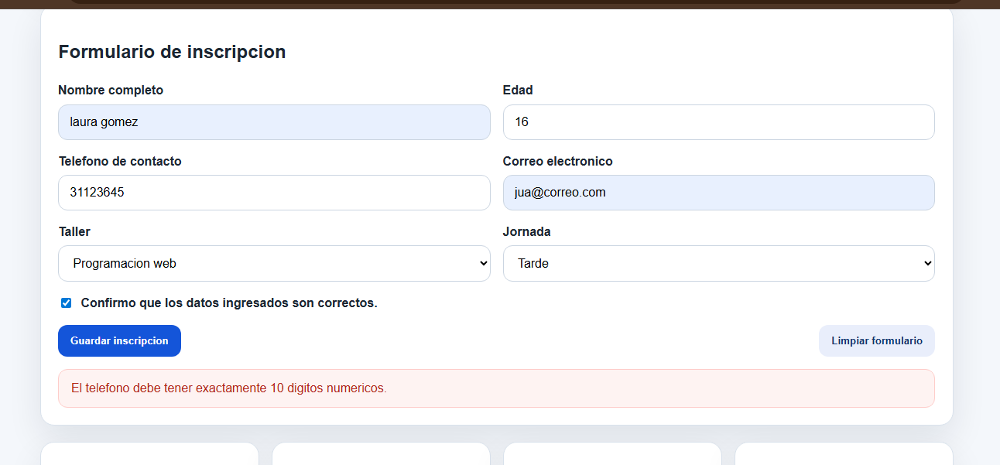
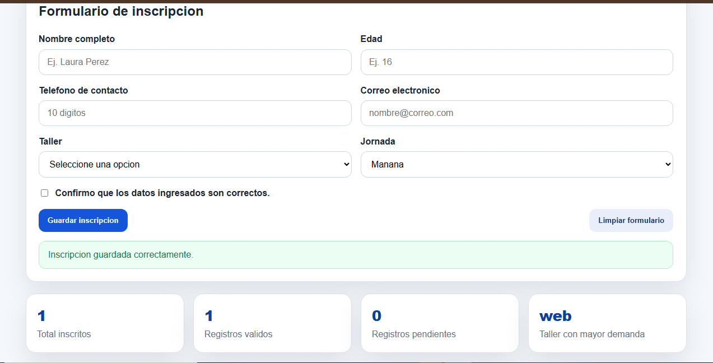
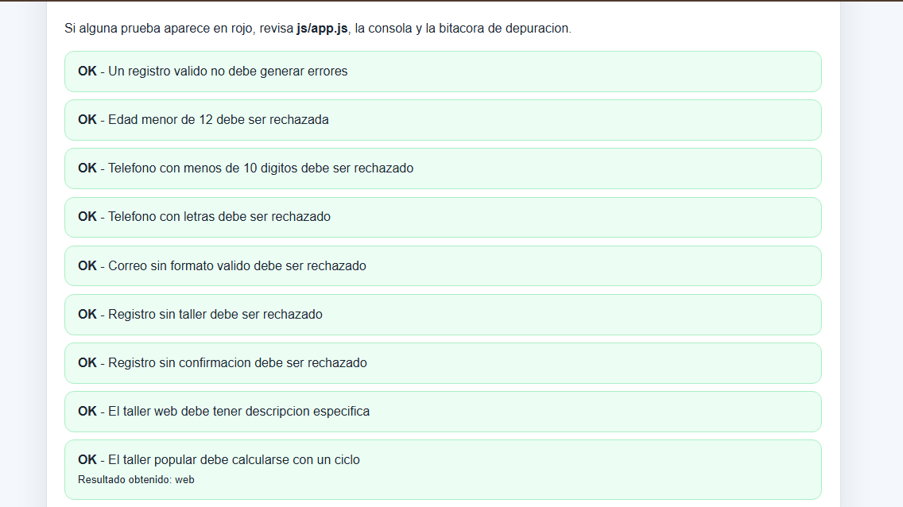
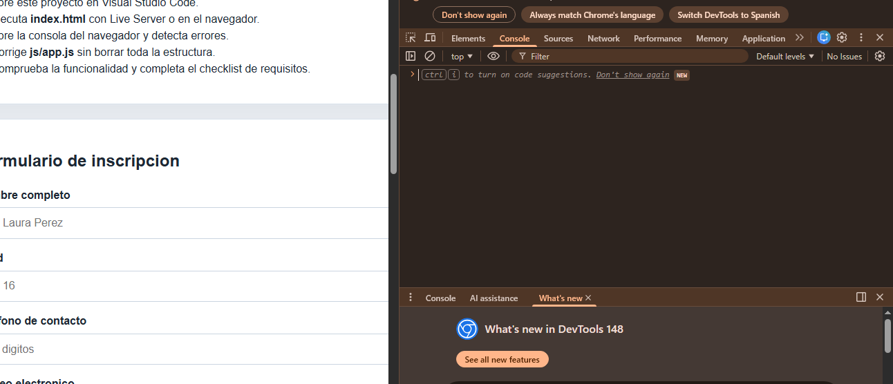

# Plantilla de evidencias

Completa esta plantilla y agrega las capturas en esta carpeta.

## Evidencia 1: error inicial en consola

Archivo de captura: 
Descripcion: Al abrir la consola del navegador, noté un error en la línea 39 de js/app.js que dice que no se puede leer .addEventListener de un elemento null. Esto pasa porque el código intenta asignarle un evento a un elemento del HTML que no encuentra, lo que significa que hay un ID o clase mal escrita en el script y eso detiene el funcionamiento del formulario.

## Evidencia 2: correccion aplicada

Archivo de captura: 
Descripcion: Corregí la función iniciarAplicacion envolviendo la línea del formulario dentro de un condicional if (form). Con esto evito que JavaScript intente leer un elemento que devuelva null y rompa la página. También le quité los paréntesis () a limpiarFormulario en el evento del botón de limpieza para pasarla como una función de referencia (callback) y que no se ejecute sola al cargar el sitio. Después de guardar los cambios y recargar, la consola quedó completamente limpia y sin errores en rojo.

## Evidencia 3: validacion de formulario invalido

Archivo de captura: 
Descripcion: Corregí este módulo por partes en mi archivo de JavaScript. Primero añadí evento.preventDefault() en manejarEnvio para que la página no se recargara sola al dar clic. Después, arreglé las condiciones dentro de validarInscripcion invirtiendo la regla de la edad, cambiando los operadores del correo y usando una expresión regular para que el teléfono exija 10 números. Al probar el formulario ingresando un teléfono incompleto de 7 dígitos, el sistema bloqueó el envío correctamente y me mostró el banner de error en pantalla.

## Evidencia 4: registro valido guardado

Archivo de captura: 
Descripcion: Completé los 10 dígitos del teléfono en el formulario ingresando un número válido (por ejemplo: 3112364589).

Le di clic al botón "Guardar inscripción".

El formulario se limpió automáticamente, me apareció el mensaje verde de éxito en pantalla y los datos se insertaron abajo en la tabla de registros.

Tomé la captura de pantalla donde se ve la tabla con los datos del usuario que acababa de inscribir junto con los contadores de arriba ya actualizados.

## Evidencia 5: pruebas automaticas

Archivo de captura: 
Descripcion: Abrí el archivo de pruebas automáticas tests.html en el navegador para evaluar sistemáticamente las funciones del script. Los resultados muestran que todos los casos de prueba unitarios pasaron con éxito (OK) en verde. Esto valida que las correcciones por partes aplicadas en las rutinas de control, las expresiones regulares de los campos y las operaciones con matrices/ciclos cumplen al 100% con los requerimientos técnicos solicitados.Abrí el archivo de pruebas automáticas tests.html en el navegador para evaluar sistemáticamente las funciones del script. Los resultados muestran que todos los casos de prueba unitarios pasaron con éxito (OK) en verde. Esto valida que las correcciones por partes aplicadas en las rutinas de control, las expresiones regulares de los campos y las operaciones con matrices/ciclos cumplen al 100% con los requerimientos técnicos solicitados.

## Evidencia 6: consola sin errores

Archivo de captura: 
Descripcion: Hice una inspección final abriendo la consola de desarrollador en la página principal. Tras aplicar de manera sistemática todas las correcciones en los selectores, eventos y estructuras de control, verifiqué que la consola se mantiene totalmente limpia y sin errores en rojo al cargar la aplicación, limpiar los campos o registrar inscripciones, logrando estabilidad total en el proyecto.
